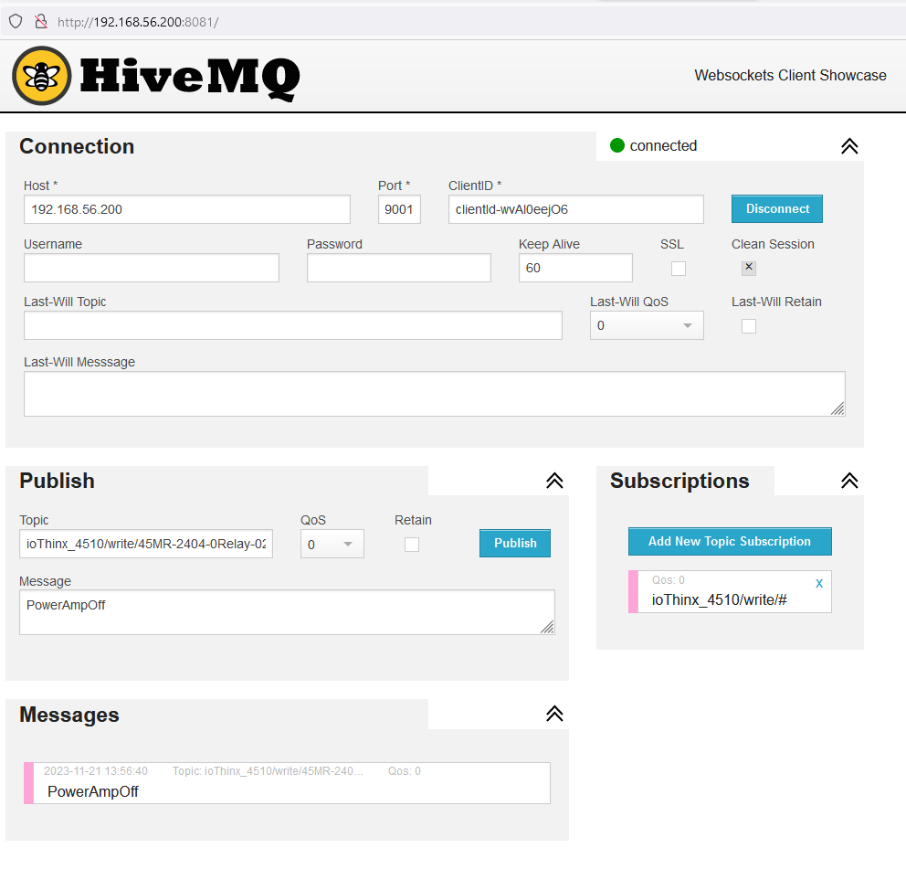
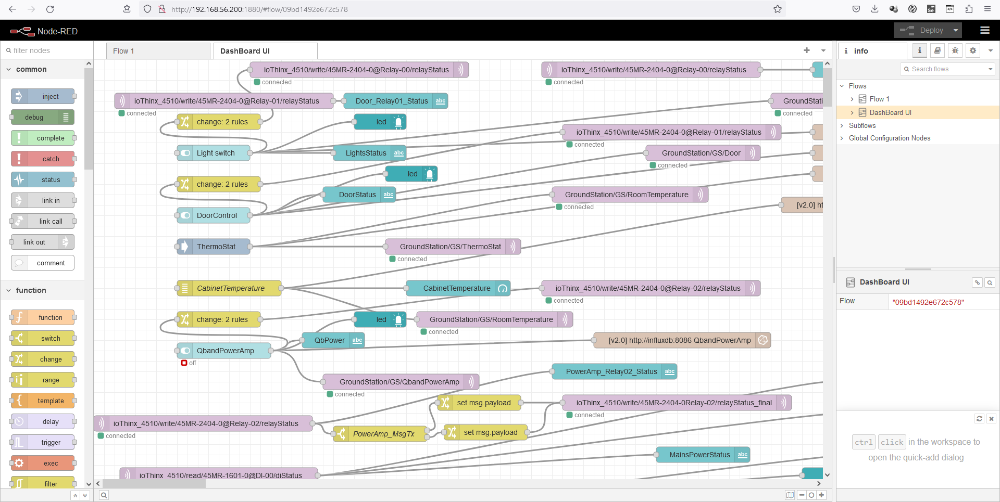
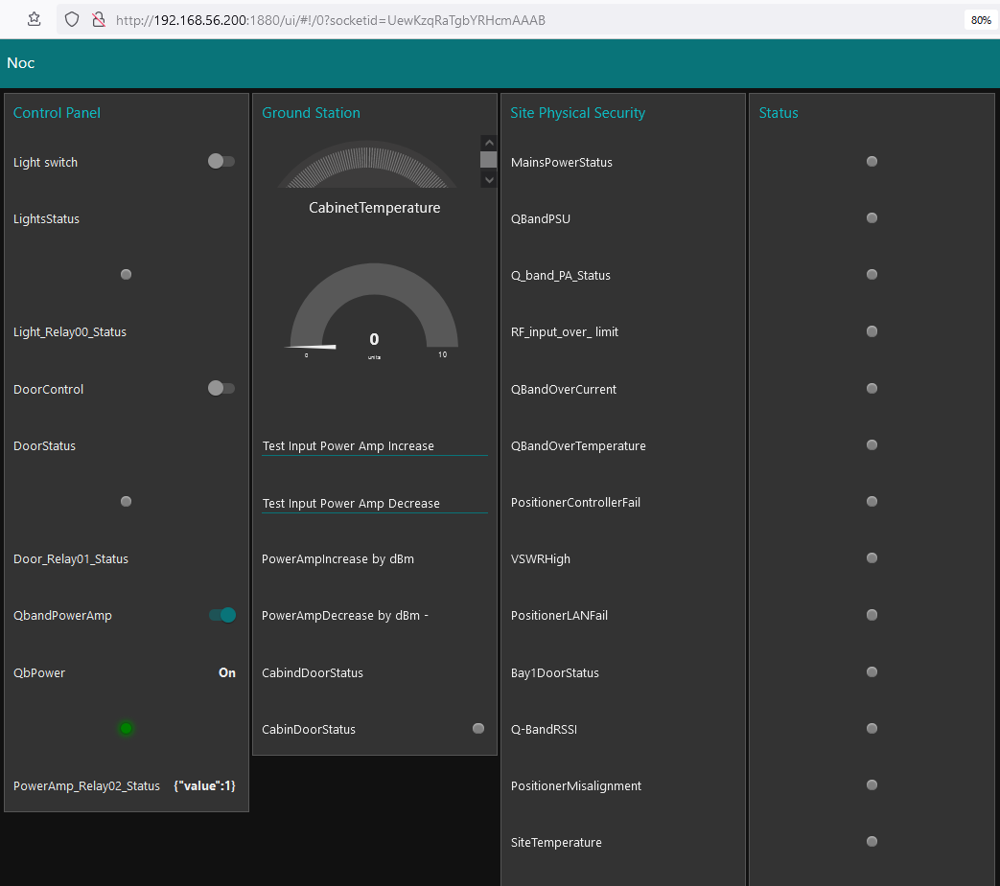
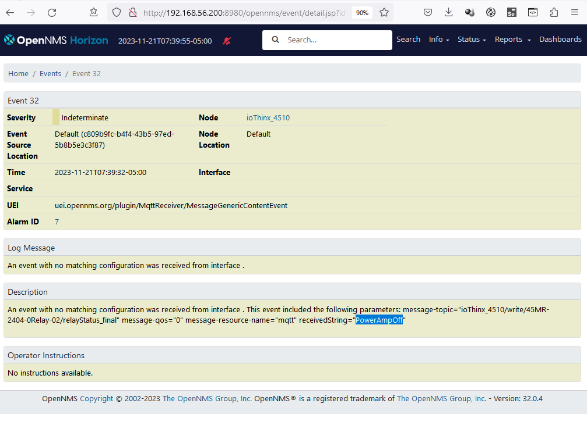

# node red mqtt example

## introduction
This docker compose project provides a complete simulation of a remote site controller which communicates using mqtt.

The simulation allows you to generate mqtt events from a Node-Red dashboard and see these events come into OpenNMS using the OpenNNMS MQTT plugin

The controller is simulated using a Node-Red container and the flow configuration is injected using flows.json 
Note that any changes made to the configuration within Node-red will not be persisted so will need to be exported and applied to the injected flows.json file.

An eclipse-mosquitto container acts as an mqtt and websocket broker

A web based mqtt client container connects to the broker using web sockets and can subscribe for the messages sent by Node-red

An OpenNMS horizon container hosts OpenNMS and there are also postgres, grafana and minion containers

## Running the example

The Node-Red simulation and OpenNMS will run using `docker compose up -d'

However you will need to build and install the mqtt client before trying to use OpenNMS to connect to MQTT

In order to build the MQTT plugin for openNMS, you must first check out and compile the OpenNMS code in order to get the build dependencies into the local maven repository.
Unfortunately these dependencies are not stored in maven central

After that you can build the MQTT plugin.
see [opennms-mqtt-plugin](https://github.com/opennms-forge/opennms-mqtt-plugin)

Make sure the version of openNMS specified in the MQTT plugin build matches the version of OpenNMS built previously.
(note this example is known to work  with horizon 32.0.5)

Once the plugin is built, you can place it in the docker compose specified deploy directory by running the simple maven build within this project

A mqtt-interface-config.xml file is injected into trhe OpenNMS etc directory.
This defines connecting to the broker and registering for events

Having downloaded and placed the plugin, you can start the whole project using `docker compose up -d'
to shutdown use `docker compose down` or `docker compose down -v` to remove any data.

##  Ports

Running firefox in rocky linux in virtual box, you can find the components here:

opennms http://localhost:8980/opennms

node-red http://localhost:1880

node-red dashboard http://localhost:1880/ui/

hivemq-mqtt-web-client http://localhost:8081

When using the web-client

set broker localhost 9001

subscribe to topic ioThinx_4510/write/#

publish to topic ioThinx_4510/write/45MR-2404-0Relay-02/relayStatus_final

This should also generate an event in OpenNMS

other ports:

influxdb 8086

eclipse mosquitto 

1883 default mqtt port

9001 default mqtt port for websockets

## images of running dashboard

Example set up of the Hive web IOT client



Example flows view in Node-Red



Example Dashboard in Node-Red



Resulting  Event in OpenNMS




## other details

https://nodered.org/docs/getting-started/docker Node red docker tutorial

https://github.com/hivemq/hivemq-mqtt-web-client Hive MQ web client

setting up firewall for external access to virtualbox

```
sudo firewall-cmd --zone=public --permanent --add-port=8980/tcp
sudo firewall-cmd --zone=public --permanent --add-port=1880/tcp
sudo firewall-cmd --zone=public --permanent --add-port=9001/tcp
sudo firewall-cmd --zone=public --permanent --add-port=1883/tcp
sudo firewall-cmd --zone=public --permanent --add-port=8080/tcp
sudo firewall-cmd --zone=public --permanent --add-port=8081/tcp
sudo firewall-cmd --zone=public --permanent --add-port=161/tcp
sudo firewall-cmd --reload
```
